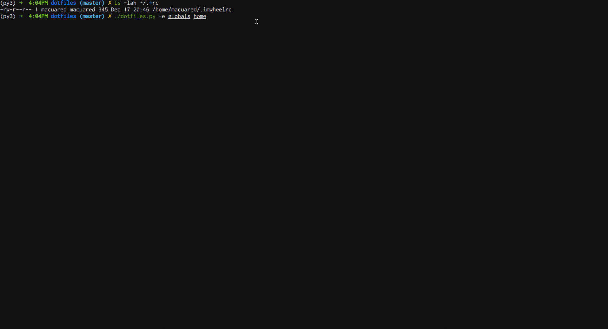
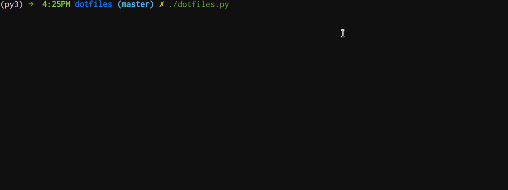
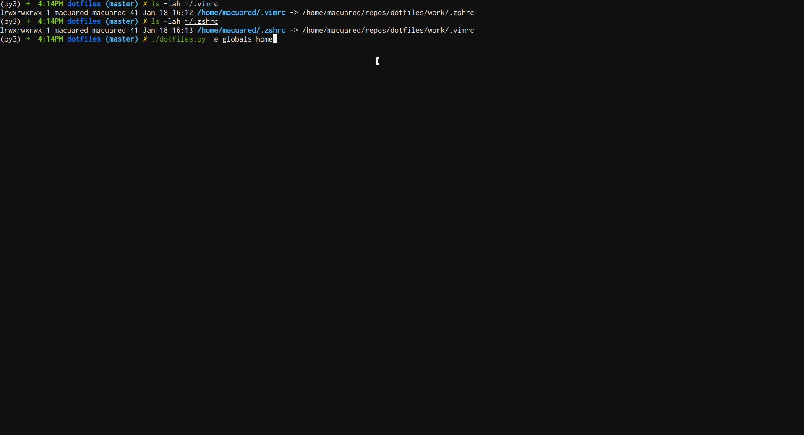
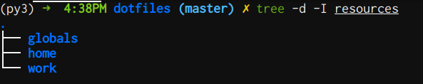
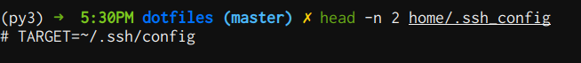
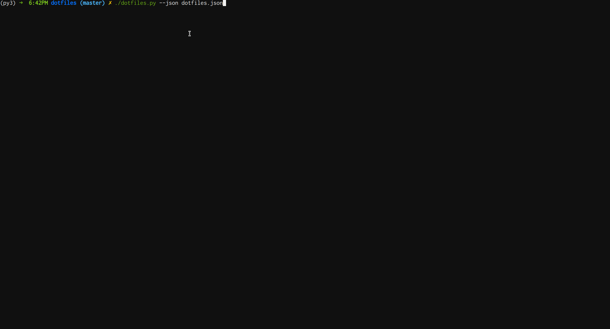

# Dotfiles Management

## What's this about?

This project was created to manage and deploy my dotfiles on new machines and keep them consistent across different environments. 

With this script, you can centralise the management of your dotfiles and make them portable so if you need to setup a new machine you can quickly deploy them with minimal effort.

## TOC
* [Installation](#installation)
* [Use cases](#use-cases)
* [Pre-requisites](#pre-requisites)
* [Usage](#usage)
* [Optional features](#optional-features)

## Installation
1. Clone and install the project dependencies
```
git clone https://github.com/danielmacuare/dotifles.git
pip3 install -r requirements.txt
```
2 - Throw all your dotfiles in any of the following folders:
```
globals/
home/
work/
```


## Use cases

### 1. New machine? Update your dotfiles easily!.


### 2. Check how all your dotfiles should be simlinked to your repo.


### 3. Update erroneours symlink in one go.


**Note:** Before making any changes, the script will backup your current files in the same folder that they live on.

## Pre-requisites
- [Python 3.6 onwards](https://gist.github.com/danielmacuare/9b916540158040701aebaaf994bf88e7) + pip
  
## Usage
### 1. Clone the repo and install the requirements.
- `git clone https://gitlab.com/daniel280187/dotfiles.git`  
- `pip install -r requirements.txt`  

### 2. Move your dotfiles to one of the following folders (Environment Folders):
  
   
 - globals/ ---> For your global dotfiles. If you want to share one dotfile between all your environments you should put it in this folder.  
 - home/ ---> For dotfiles to be maintained in your home pc.
 - work/ --> for dotfiles to be maintained in your work pc.  
  
### 3. Print the list of dotfiles that the script is recognising.  
`./dotfiles.py`


    If all looks good jump to Point 4.

**Default Target:**    
`environment/<dotfile_name> -->  ~/<dotfile_name> `  
- `home/.bashrc --> target: ~/.bashrc`  
- `globals/.vimrc --> ~/.vimrc`

### 4. Use the `--env` or `-e` (environments) options to choose the dotfiles you want to add to the current machine. You should add the `globals + home` (for your home PC) or `global + work` (for your work PC).

`./dotifles --env globals home`


### 5. **Enjoy!!** You now have got all your dotfiles symlinked to the repo and you can manage them in one central place.

  


## Optional Features
- **Ignoring files and folders:**  
You can ignore files or folders by updating the `.dotignore` file. This way, the script won't add them to the list of available dotfiles when you execute `./dotfiles.py`  
  

- **Custom targets:**  
If you want to change the target (where the dotfile should be copied to) of a dotfile, please put the following parameter on the first line of your dotfile.  
For example, if you want to use this script to manage the ssh config file. you can do the following: 
  - `cp ~/.ssh/config home/.ssh_config`  
  - Put the following in the first line of `home/.ssh_config` --> `# TARGET=~/.ssh/config`    
   - 

- **Print the dotfiles table to JSON**  
  `./dotfiles.py --json <file-name>` 
  
  
  
  
  **Note**: If no file-name is passed to the `--json` option then a json the output file will created at  `db.json` on the current dir.


